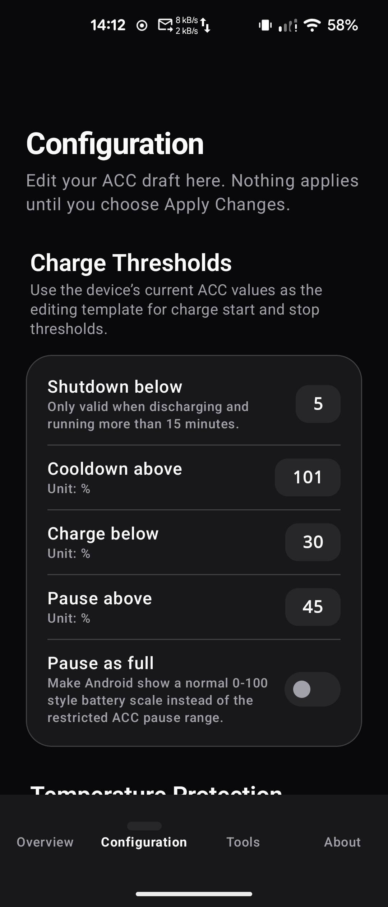
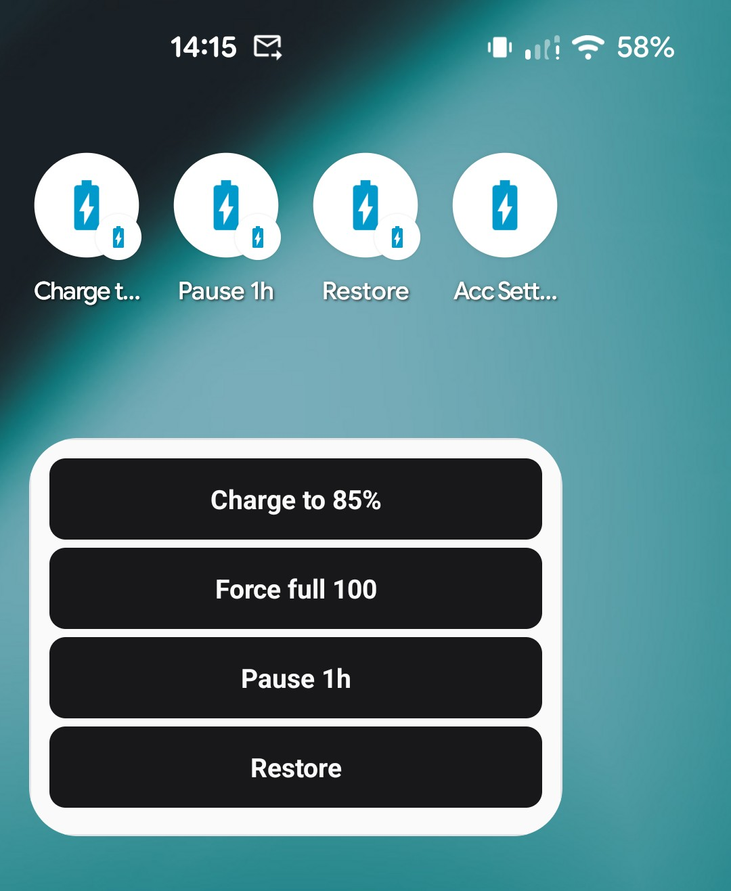
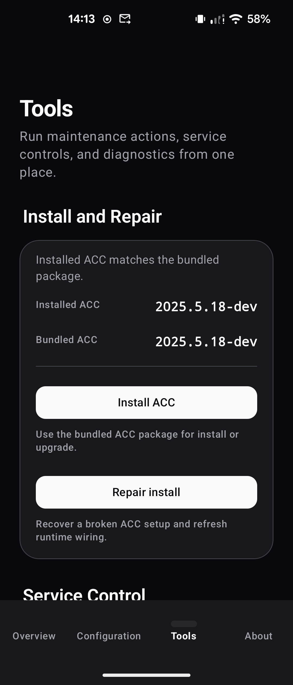
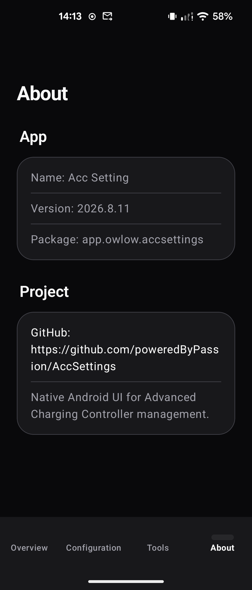
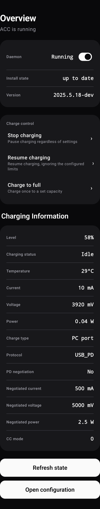
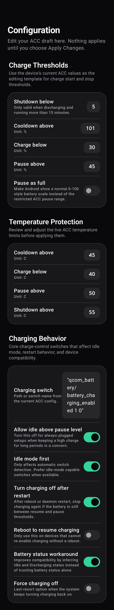
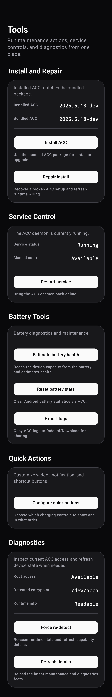

# Acc Setting

Acc Setting is a native Android app for managing [Advanced Charging Controller (ACC)](https://github.com/VR-25/acc) on rooted devices.

It provides a modern Compose-based interface for checking ACC status, editing configuration safely, running maintenance actions, and viewing device battery information from Android system APIs.

## What It Does

- Shows ACC install state, daemon status, version information, warnings, and next actions on the Overview page
- Displays live battery information on the home screen, including level, charging status, temperature, current, voltage, and power
- Refreshes battery information automatically every 3 seconds while the Overview page is visible
- Provides one-shot charging-control operations: pause charging, resume to a target, and force-full charge — mutually exclusive, with live countdowns while active
- Shows an ongoing notification with countdown, battery level, and action buttons while a charging operation is active
- Adds a home-screen widget (4x2) and Quick Settings tile for one-tap access to your configured quick actions
- Lets you customize quick actions: add, remove, reorder, and parameterize up to five actions, and toggle the widget battery row
- Runs quick actions from launcher app shortcuts (dynamic, follow your config)
- Estimates battery health automatically by reading the design capacity from sysfs
- Uses draft-based configuration editing so changes can be reviewed before applying them to the device
- Provides install, update, repair, restart, refresh, and re-detect tools for ACC
- Includes anchored inline feedback for important actions instead of forcing users to scroll to the top
- Supports English and Simplified Chinese

## Screens

- `Overview`: ACC status, runtime facts, battery information, and charging-control quick actions
- `Quick Actions`: configure which quick actions appear on the widget, notification, and shortcuts (up to 5, reorderable, parameterized)
- `Configuration`: draft editing for ACC config values before apply
- `Tools`: install, repair, service control, diagnostics, and runtime logs
- `About`: app details and clickable project repository link

## Screenshots

<div align="center">
  
  
  
  
</div>

### Full pages

<div align="center">
  
  
  
</div>

## Requirements

- Android SDK 36
- Java 17 or newer
- Rooted target device for real ACC integration
- ACC is only required on the device if you want full controller management features

## App Info

- App name: `Acc Setting`
- Acc Version: 2025.5.18-dev
- Application id: `app.owlow.accsettings`
- Minimum SDK: 23
- Target SDK: 36

## Build And Test

```bash
./gradlew testDebugUnitTest
./gradlew assembleDebug
./scripts/build-debug-apk.sh
```

## Project Layout

- `app/`: Android application module
- `docs/`: plans and project documentation
- `scripts/`: local build helpers

## Notes

- Battery information on the Overview page comes from ACC runtime info (via `acc --info`) with a fallback to Android system battery APIs when ACC/root is unavailable
- Some battery values depend on device support, so current or power may be unavailable on certain devices
- Real ACC operations such as install, repair, daemon control, and charging control require root and a compatible rooted environment

## Documentation

- [Changelog](CHANGELOG.md)
- [Docs index](docs/README.md)
